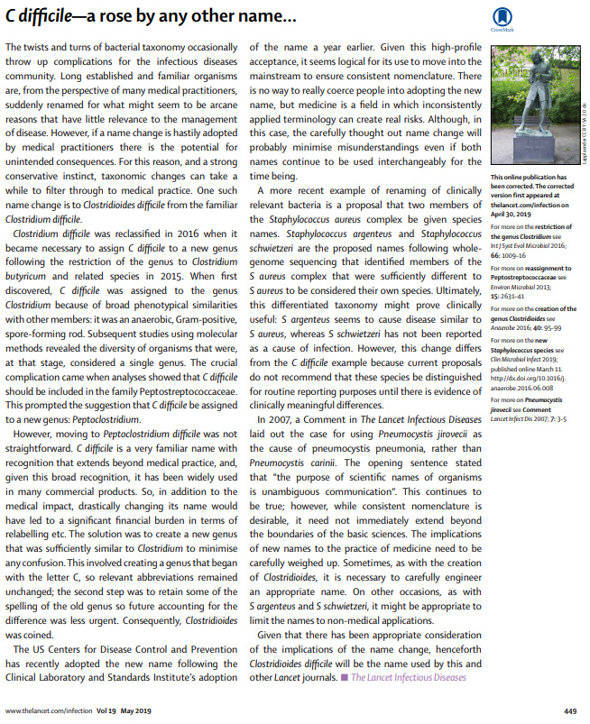
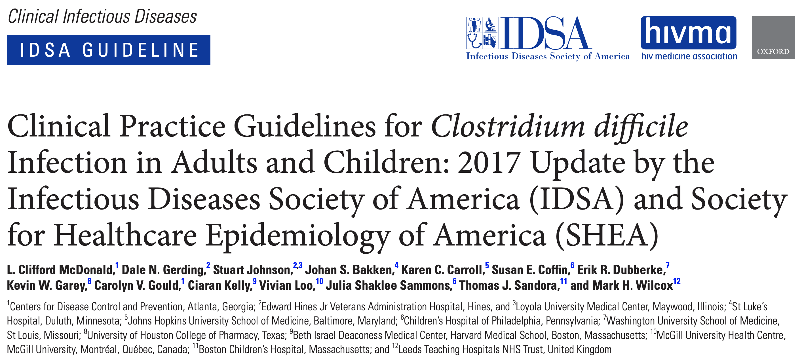

```{r setup, include=FALSE}
options(htmltools.dir.version = FALSE)
xaringan::summon_remark()
```

```{r xaringan-tile-view, echo=FALSE}
xaringanExtra::use_tile_view()
xaringanExtra::use_webcam()
xaringanExtra::use_tachyons()
xaringanExtra::use_animate_css()
```

## Disclosures <hr/>

- No conflicts of interest.  

- Opinions my own.  


---

## Learning Objectives <hr/>

- New genus! Introducing _<ins>Clostridioides</ins> difficile_!

- _C. difficile_ diagnosis:  

    - highlights from IDSA Guideline update: distinguishing colonization from disease

- _C. difficile_ treatment:  

    - highlights from IDSA Guideline update: new initial and recurrent CDI tx recs  
    
    - therapies not covered in detail by guideline (FMT, surgical, immune)

- _C. difficile_ prevention:  

    - prophylactic antibiotics?
    
    - antibiotic stewardship & infection control  
 

---

class: inverse, center, middle

# New Name for an Old Foe


---

## _Clostridioides_ - a New Genus <hr/>

.pull-left[

- 2013: phylogenetic analyses suggest _C. difficile_ belongs in family _Peptostreptococcaceae_.

- Suggested name change: " _Peptoclostridium_ ". But believed drastic name change would create confusion.

- "The genus _Clostridium_ as presently constituted is phylogenetically and phenotypically incoherent." Restrict genus to _Clostridium butyricum_ and related species.

- Clinical Laboratory and Standards Institute (CLSI) & US CDC adopted _Clostridioides_ as compromise. Retain " _C. difficile_ "!

]

.pull-right[




]

.footnote[Yutin N & Galperin MY _Env Micro_ 2013; Lawson PA & Rainey FA _Int J Sys Ev Micro_ 2016; Editorial _Lancet Inf Dis_ 2019]


---

class: inverse, center, middle

# New IDSA Guidelines


---

## IDSA Guidelines <hr/>

.pull-left[

- Synthesizes lots of new data in field where basic science and therapies are evolving rapidly.

- Big changes!  

    - **New recommendation for diagnostic testing algorithm**.

    - **New recommendation for initial treatment**.

    - **New recommendation for recurrent CDI (R-CDI) treatment**.


]

.pull-right[

]

.footnote[McDonald LC et al _Clin Inf Dis_ 2018]


---

class: inverse, center, middle

# How to Diagnose _C. difficile_ : Toxin or Toxigenic Bacteria?


---


## Where Have All My PCR Tests Gone? <hr/>

.pull-left[

- IDSA (& ESCMID) prefer multi-step testing:  

    - glutamate dehydrogenase (GDH) EIA followed by toxin EIA, "arbitrated" by nucleic acid amplification test (NAAT)  
    - OR NAAT plus toxin EIA

- NAAT alone or (high-sensitivity) toxin EIA alone only if can ensure high pre-test probability of CDI:

    - evidence that colonization among healthcare-exposed patients is common (NAAT too sensitive)
    - degree of disease tracks with quantity of detectable toxin


]

.pull-right[


]

.footnote[Planche et al _Lancet Inf Dis_ 2013; Beaulieu _CMI_ 2014; Polage _JAMA Int Med_ 2015; McDonald LC et al _Clin Inf Dis_ 2018; Gateau C et al _CMI_ 2018]


---

## Interpreting Multi-Step _C. difficile_ Tests <hr/>

- Too many tests for _C. difficile_: common antigen / glutamate dehydrogenase (GDH) EIA, toxin A/B EIA, nucleic acid amplification test (NAAT, aka PCR), toxigenic culture (TC), cytotoxicity assay (CTA).  

- Question: do we want to measure presence of toxigenic bacteria, or level of toxin production _in vivo_?

- Current recommendation emphasizes <ins>measuring both</ins>:  

    - is there toxigenic _C. difficile_ present? GDH or NAAT
    - is there measurable toxin A/B? toxin EIA

- Clinical decision to treat depends on alternate explanations for diarrhea.  

- <mark>Beware the patient with only NAAT+ testing who fails to respond to anti-CDI antibiotics</mark>.


---

## Is Ultrasensitive Toxin Testing the Answer? <hr/>

- Colonization by toxin-producing _C difficile_ does not equate with disease (necessary but not sufficient)  

- Can we measure free toxin with greater sensitivity and specificity? (e.g., "digital ELISAs")

- Analytic challenges with validation:  

    - comparison test is cytotoxicity assay (CTA)
    - how does _ex vivo_ toxin production relate to _in vivo_ toxin production?  
    
- Clinical challenges with validation:

    - clinical diagnosis of CDI difficult to adjudicate
    - 5-log range of toxin concentration (0-1e5 pg/mL) in both CDI-NAAT and carrier-NAAT populations


.footnote[Song L et al _JCM_ 2015; Pollock NR _JCM_ 2016; Pollock NR et al _Clin Inf Dis_ 2019]


---
class: inverse, center, middle

# How to Treat _C. difficile_


---

background-image: url(cdiff_txrec_clean.png)
background-size: contain


---

background-image: url(cdiff_txrec_mark_initial.png)
background-size: contain


---

background-image: url(cdiff_txrec_mark_recurrent.png)
background-size: contain


---


## IDSA: Initial and Recurrent _C. difficile_ Treatment <hr/>

- Initial CDI:

    - metronidazole only for mild disease, only if contraindication to VAN/FID
    - vancomycin dosing 125mg QID (regardless of severity)
    - though fidaxomicin first line, not preferred

- Recurrent CDI:  

    - prolonged, tapered pulse regimen of vancomycin
    - rifaximin "chaser" regimen: 400mg TID for 20d
    - fidaxomicin "chaser" regimens: standard 10d BID versus 7d DAILY then 26d QOD
    - <mark>the pulse is more important than the taper</mark>


.footnote[McDonald LC et al _Clin Inf Dis_ 2018; Bakken _Clin Inf Dis_ 2014; Soriano MM et al _OFID_ 2014; Johnson S _Gastro Hep_ 2017; Ooijevaar RE et al _CMI_ 2018]


---

## IDSA: Fulminant _C. difficile_ Treatment <hr/>

- Not much change:

    - enteral high-dose vancomycin
    - <mark>add rectal vancomycin in case of ileus</mark>
    - intravenous metronidazole

- Role for FMT? (case reports)  

- Role for bezlotoxumab?

- (Toxin binding polymers abandoned after tolevamer trial).


.footnote[McDonald LC et al _Clin Inf Dis_ 2018; Johnson S et al _Clin Inf Dis_ 2014]


---

## Updates on Fecal Microbiota Transplantation (FMT) <hr/>

- The honeymoon is over:  

    - March 19, 2019: OpenBiome nearly doubled prices
    - June 13, 2019: FDA safety alert regarding FMT-related sepsis and death
    - Xing Tang & Stuart Johnson editorial: "Fecal microbiota transplantation (FMT) for C. difficile infection, just say 'No'"

- Multiple companies with "ecobiotic" FMT alternatives in phase 2/3 trials:  

    - Finch, Rebiotix, Seres, Vedanta
    - FDA update planned after meeting November 4, 2019

- IDSA Guidelines: "The opinion of the panel is that appropriate antibiotic treatments for at least 2 recurrences (ie, 3 CDI episodes) should be tried prior to offering fecal microbiota transplantation."


.footnote[Tan X & Johnson S _Anaerobe_ 2019; McDonald LC et al _Clin Inf Dis_ 2018]


---

## Updates on Surgical Therapy for CDI <hr/>

- IDSA Guidelines:  

    - "If surgical management is necessary for severely ill patients, perform subtotal colectomy with preservation of the rectum (strong recommendation, moderate quality of evidence)."  
    
    - "Diverting loop ileostomy with colonic lavage followed by antegrade vancomycin flushes is an alternative approach that may lead to improved outcomes (weak recommendation, low quality of evidence)."  
    
- Increasing proportion of patients undergoing diverting loop ileostomy vs colectomy:  

    - 11.16% diverting loop ileostomy in 2011 increased to 25.3% in 2015
    - No significant difference in in-hospital mortality rate between the groups (retrospective cohort)


.footnote[McDonald LC et al _Clin Inf Dis_ 2018; Neal MD _Ann Surg_ 2011; Juo YY et al _JAMA Surg_ 2019]


---

## Updates on Immune Therapy for CDI <hr/>

- **Bezlotoxumab**: monoclonal anti-toxin B antibody (binds 2 sites and occludes 2 binding pockets; blocks binding to host receptor proteoglycan CSPG4)  

- Approved as adjunctive therapy for patients who are receiving antibiotic treatment for CDI and who are at high risk for recurrence:  
    
    - one or more of the following prespecified risk factors had reduced risk for subsequent CDI, for 30-day readmission for CDI, and for avoidance of treatment with fecal transplantation: (1) age >65 years, (2) history of CDI, (3) immunocompromise, or (4) severe CDI
    
    - among this subpopulation, decreased the rate of hospital readmission within 30 days compared to placebo (absolute difference, −6.1% [95% CI, −9.5% to −2.8%])
    
    - patients with no risk factors showed no benefit from adjunctive therapy with bezlotoxumab

- <mark>Caution with congestive heart failure</mark>: serious adverse event due to heart failure was recorded in 12.7% (15/118) of the bezlotoxumab group and in 4.8% (5/104) of placebo group; 19.5% (23/118) and 12.5% (13/104) of this subgroup died


.footnote[Wilcox MH et al _NEJM_ 2017; Gerding DN et al _Clin Inf Dis_ 2018; Johnson S & Gerding DN _Clin Inf Dis_ 2019]


---

## Updates on Antibiotic Therapy for CDI <hr/>

- More precisely targeted therapy for _C. difficile_:

    - **cadazolid**: failed to achieve non-inferiority to vancomycin for CDI clinical cure in a phase 3 trial   
    
    - **ridinilazole**: phase 3 trial in progress  

- Gut microbiome protection:

    - **ribaxamase** (oral beta-lactamase, aka SYN-004) reduces CDI incidence 2/2 CAP tx in phase 2b trial  
    
    - activated charcoal (DAV132) in phase 2 in combination with quinolone tx for febrile neutropenia  


.footnote[Gerding DN et al _Lancet Inf Dis_ 2019; Cho JC et al _Annals Gastro_ 2019; Kokai-Kun JF et al _Lancet Inf Dis_ 2019; Burdet C et al _AAC_ 2019]


---
class: inverse, center, middle

# How to Prevent _C. difficile_


---

## To Prophylax or Not to Prophylax... <hr/>

- What to do for patients with prior CDI and subsequent antibiotic exposure?

    - evidence mostly from small observational studies with c/f unmeasured confounding
    
    - IDSA guidelines avoided making recommendation: "the long-term benefit is unknown. To date there are no prospective, randomized studies of secondary prophylaxis of CDI to guide recommendations..."  
    
    - "... if the decision is to institute CDI prevention agents, it may be prudent to administer low doses of vancomycin or fidaxomicin (eg, 125 mg or 200 mg, respectively, once daily) while systemic antibiotics are administered."


.footnote[Van Hise et al _Clin Inf Dis_ 2016; Carignan _Am J Gastro_ 2016; Caroff DA et al _ICHE_ 2019; Zhang K et al _BMC Inf Dis_ 2019]


---

## Infection Control to Prevent CDI <hr/>

- IDSA Guidelines:  

    - suspected CDI -- place on preemptive contact precautions pending the _C. difficile_ test results  
    
    - continue contact precautions for at least 48 hours after diarrhea has resolved  
    
    - prolong contact precautions until discharge if CDI rates remain high despite implementation of standard infection control measures against CDI  
    
- Screening for _C. difficile_ colonization on admission?  

    - quasi-experimental study of NAAT screening on admission: 7599 screened, 368 (4.8%) positive; during the intervention, 3.0 HA-CDI cases per 10,000 patient-days versus 6.9 per 10,000 patient-days preintervention 
    
    - detecting and isolating C difficile carriers may be associated with a significant decrease in the incidence of HA-CDI


.footnote[McDonald LC et al _Clin Inf Dis_ 2018; Longtin Y et al _JAMA Int Med_ 2016]


---

class: inverse, center, middle

# Conclusions


---

## Conclusions <hr/>

- _Clostridoides difficile_.

- Two-step diagnostic testing preferred (detect toxigenic bacteria and free toxin).

- Oral vancomycin and fidaxomicin preferred for initial therapy.

- To consider "pulse" taper vancomycin or fidaxomicin/rifaximin "chaser" for multiply recurrent CDI.

- Novel antibiotics and infection control strategies in the pipeline.


---

class: inverse, center, middle


